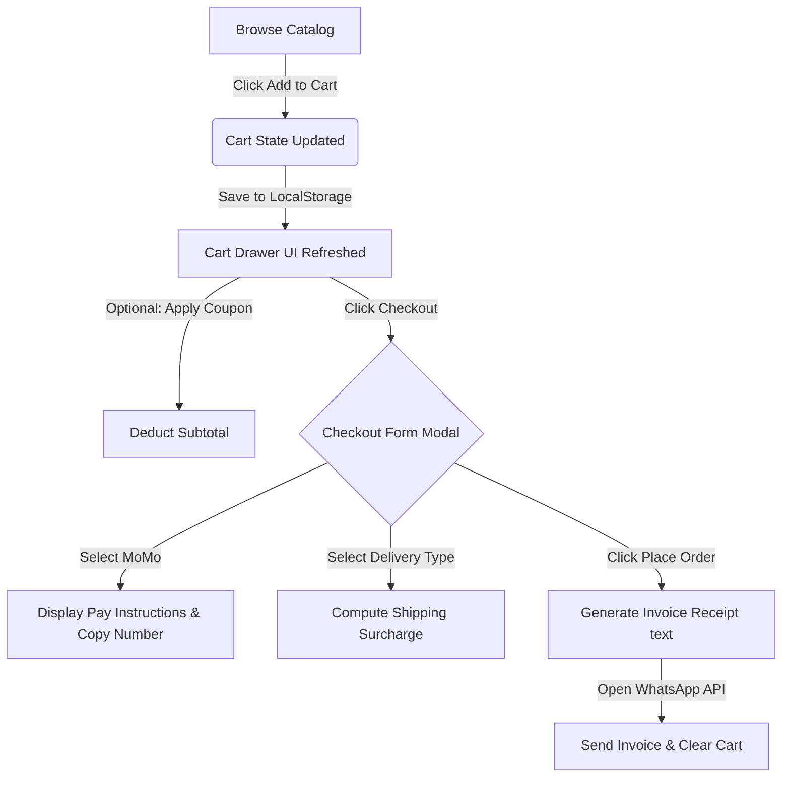

# 🌟 BrainiacTech Hub — Hardware, Software & IT Solutions

> A premium, fully responsive, and highly interactive client-side E-Commerce platform for technology services, computer accessories, and software products.

---

## 📖 Table of Contents
- [✨ Core Features](#-core-features)
- [🛠️ Technology Stack](#%EF%B8%8F-technology-stack)
- [📦 Directory Structure](#-directory-structure)
- [🚀 Local Setup & Installation](#-local-setup--installation)
- [🛒 E-Commerce & Checkout Pipelines](#-e-commerce--checkout-pipelines)
- [🎨 Design Aesthetics](#-design-aesthetics)
- [📝 License](#-license)

---

## ✨ Core Features

### 1. 📱 Premium Mobile Responsiveness
*   **Dynamic Viewport Scaling**: Flawlessly optimized across all device classes (Desktop, Laptop, Tablet, and Phones down to `320px` viewports) with zero horizontal layout overflows.
*   **Animated Hamburger Toggle**: Under `900px`, the desktop navigation slides into a beautiful, glassmorphic full-screen modal menu while the hamburger bar rotates smoothly into an "X".
*   **Adaptive Hero mockups**: Displays a customized hardware service dashboard graphic centered and scaled down under the Hero content on tablet/mobile views (rather than hiding it), maintaining complete brand impact.

### 2. 🛒 Dynamic Shopping Cart Drawer
*   **Interactive Counter Badge**: Floating, scale-animated item count bubble overlays the sticky navbar cart button.
*   **Slide-out Cart Panel**: A right-aligned shopping cart side drawer built with glassmorphic blurs (`backdrop-filter`) and smooth transitions.
*   **State Control**: Incremental controls (`+` / `-`) to adjust quantities on the fly, quick delete triggers, and live computed subtotals.
*   **Storage Persistence**: Selection states are saved to and loaded from `localStorage`, preserving customer selections across browser restarts.
*   **Micro-interaction Toasts**: Modern, bottom-left sliding alert bars flash brief confirmations when items are added, modified, or removed.

### 3. 🔍 Live Search & Category Filters
*   **Real-time Keyword Filter**: An instant search input box parses titles and IDs as the user types, hiding non-matching cards immediately.
*   **Category Filter Pills**: Interactive selector pills let users filter product cards immediately by category (Accessories, Office, Components, Networking, Software).
*   **Zero-State Hiding**: If a search/filter leaves a product category empty, that category header hides dynamically. If all categories are empty, a clean "No Products Found" empty state is displayed.

### 4. 👁️ Product Quick View Details Modal
*   Clicking on any product image or card title triggers a premium specifications details modal containing:
    *   High-resolution product illustration.
    *   Active inventory stock badge ("In Stock" / "Out of Stock").
    *   A computed star rating display with total customer review counters.
    *   Deep product summaries and use-case highlights.
    *   A list of **Key Technical Specifications** custom-tailored for each of the 45 catalog products.
    *   Direct "Add to Cart" button within the quick view interface.

### 5. 🏷️ Dynamic Coupon Discount Engine
*   Includes a "Have a promo code?" coupon input box inside the Cart Drawer footer supporting:
    *   `WELCOME10`: 10% off cart total.
    *   `STUDENT5`: 5% off student discount.
    *   `KNUST`: Flat GH₵ 50.00 student discount.
*   Deducts coupon savings from the cart drawer, checkout modal invoice total, and includes the savings data inside final order notifications.

### 6. 💵 MTN Mobile Money (MoMo) Integration
*   Selecting **Mobile Money** as the payment method displays an interactive yellow MTN MoMo instructions guide.
*   Features the official store merchant number: **`0201453942`**.
*   Includes a quick **Copy Button** that copies the merchant phone number instantly to the user's clipboard and flashes a toast confirmation.

### 7. 💬 Seamless WhatsApp Checkout Redirection
*   Generates a unique, randomized Order Receipt ID (e.g. `#BTH-18491849`).
*   Toggles shipping addresses dynamically based on selected delivery types (Self-Pickup, Kumasi Delivery, or Nationwide Shipping).
*   Compiles a beautiful invoice receipt pre-populated into a standard WhatsApp message. On submission, the user is redirected immediately to the WhatsApp API to finalize their transaction, and the client-side cart automatically clears.

---

## 🛠️ Technology Stack

*   **HTML5 & CSS3**: Formatted using native semantic elements, dynamic layout calculations, custom media queries, and harmonious curated color values.
*   **Vanilla JavaScript**: High-performance, lightweight, client-side scripts doing DOM-price injection, star ratings, state CRUD tracking, filter algorithms, and modal triggers with zero external framework dependencies.
*   **Google Fonts & Icons**: Features Poppins modern typography and Font Awesome 6.5.0 icons.

---

## 📦 Directory Structure

```directory
brainiactech-hub-website-master/
├── index.html       # Primary entry page containing structural tags & modals
├── styles.css       # Layout styles, media queries, animations & variables
├── cart.js         # Dynamic e-commerce engine & 45-product specs database
├── README.md        # Professional documentation (this file)
└── images/          # Genuine, high-resolution product thumbnails & logos
```

---

## 🚀 Local Setup & Installation

The BrainiacTech Hub website is completely client-side and requires **zero compilation, zero installations, and zero server configurations**!

1.  **Clone the Repository**:
    ```bash
    git clone https://github.com/brainiacweb-tech/brainiactech-hub-computer-accessories-.git
    ```
2.  **Navigate to Directory**:
    ```bash
    cd brainiactech-hub-computer-accessories-
    ```
3.  **Run Locally**:
    Simply double-click `index.html` or open it in any modern web browser!
    To serve it with live-reload during developer iterations, you can use standard IDE extensions like VS Code's "Live Server".

---

## 🛒 E-Commerce & Checkout Pipelines

The e-commerce loop behaves securely inside the customer's browser:


---

## 🎨 Design Aesthetics

*   ** Harmonious Contrast**: Features sleek white theme card surfaces (`#ffffff`), soft slate text colors (`#334155`), and premium ice blue gradients (`linear-gradient(135deg, #1a73e8 0%, #0ea5e9 100%)`).
*   **Micro-animations**: Hover micro-interactions on product cards, menu toggles, button sliders, and slide-in panels offer high tactile feedback.
*   **Glassmorphism Effects**: Blurred panel backdrops (`rgba(255, 255, 255, 0.98)` with a `blur(20px)`) give overlays an extremely premium feel.

---

## 📝 License

This project is licensed under the standard repository [LICENSE](LICENSE) terms. 

---

Developed with 💙 by **BrainiacTech Hub** — *Technology Solutions at KNUST Campus & beyond.*
